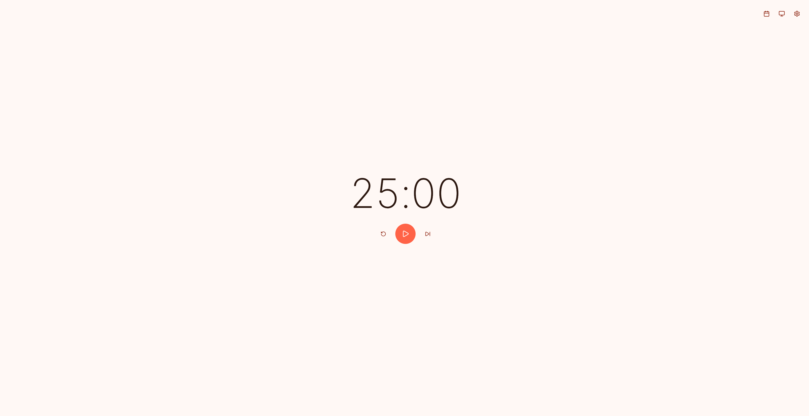

# 🍅 Pomodoro Timer (番茄钟)

[English](../README.md) | **中文**

一个基于 React 和 Vite 构建的现代化番茄钟应用，旨在通过简洁的界面和实用的功能提升您的工作效率。

## ✨ 功能特性

- **高效计时器**：严格遵循番茄工作法（25 分钟工作 / 5 分钟短休息 / 15 分钟长休息）。
- **动态背景效果**：
  - 专注模式（Work）：背景变为活力十足的番茄红 (`#FF6347`)。
  - 休息模式（Break）：背景变为轻松的草坪绿 (`#4CAF50`)。
- **智能主题管理**：支持浅色模式、深色模式以及跟随系统设置。
- **活动热力图**：展示过去 365 天的番茄钟完成记录，类似于 GitHub 的贡献图，助您复盘效率。
- **持久化存储**：您的历史记录和主题偏好将自动保存至浏览器的 `localStorage` 中。
- **音频通知**：每当一个阶段完成时，应用会通过 Web Audio API 播放清脆的提醒音。
- **全平台适配**：响应式设计，在移动端和桌面端均有出色表现。

## 📸 界面预览



## 🚀 快速开始

### 前提条件

- [Node.js](https://nodejs.org/) (建议版本 18+)
- [npm](https://www.npmjs.com/) 或 [yarn](https://yarnpkg.com/)

### 安装与运行

1. **克隆仓库**
   ```bash
   git clone https://github.com/657KB/pomodoro-timer.git
   cd pomodoro-timer
   ```

2. **安装依赖**
   ```bash
   npm install
   ```

3. **启动开发服务器**
   ```bash
   npm run dev
   ```

4. **构建生产版本**
   ```bash
   npm run build
   ```

## 🛠️ 技术栈

- **框架**: React 18
- **构建工具**: Vite
- **样式**: Vanilla CSS (无外部 CSS 框架)
- **状态管理**: React Hooks (useState, useEffect, useCallback, useRef)
- **数据存储**: LocalStorage API
- **音频处理**: Web Audio API

## 📂 项目结构

```text
src/
├── App.jsx              # 主应用组件
├── App.css              # 应用级样式
├── index.css            # 全局变量、主题变量及基础样式
├── main.jsx             # 程序入口
├── components/
│   ├── Timer.jsx        # 计时器显示及控制组件
│   ├── Timer.css
│   ├── HeatMap.jsx      # 活动热力图组件
│   └── HeatMap.css
├── hooks/
│   ├── useTimer.js      # 核心计时逻辑 (倒计时、模式切换)
│   ├── usePomodoro.js   # 历史记录追踪与持久化
│   ├── useTheme.js      # 主题切换逻辑 (浅色/深色/系统)
│   └── useRunningBackground.js  # 运行状态下的动态背景效果
└── utils/
    └── sound.js         # 基于 Web Audio API 的通知音效
```

## 📄 开源协议

本项目采用 [MIT](../LICENSE) 协议。
